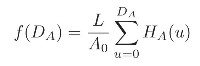

# 算法描述

### 1.直方图均衡

读取 river.jpg ，获取其直方图，这里注意 matlab 向量从 1 开始计数，所以需要 +1：

```matlab
img = imread('river.JPG');
[m,n] = size(img);
histogram = zeros(1,256);

% get histogram
for i = 1:m
    for j = 1:n
        histogram(img(i,j) + 1) = histogram(img(i,j) + 1) + 1;
    end
end
```

直方图均衡：

这里直接使用课本中的公式：



变量`temp`储存累加值，L = 255，A0 = m*n。计算后得到的向量`tmap`即为直方图均衡的灰度变化函数，需要注意的是使用`floor()`函数向下取整：

```matlab
for i = 1:256
    temp = 0;
    for j = 1:i
        temp = temp + histogram(j);
    end
    tmap(i) = floor(temp*255/(m*n));
end
```

使用`tmap()`映射得到直方图均衡图像：

```matlab
for i = 1:m
    for j= 1:n
        target(i,j) = tmap(img(i,j)+1);
    end
end
```

### 2.直方图匹配

读取两幅图，并分别获取其直方图向量：

```matlab
lina = imread('LENA.png');
eightam = imread('EightAM.png');
[m,n] = size(lina);
[a,b] = size(eightam);
lina_hist = zeros(1,256);
eightam_hist = zeros(1,256);

% get lina histogram
for i = 1:m
    for j = 1:n
        lina_hist(lina(i,j) + 1) = lina_hist(lina(i,j) + 1) + 1;
    end
end
figure
bar(0:255,lina_hist,'b')

% get eightam histogram
for i = 1:a
    for j = 1:b
        eightam_hist(eightam(i,j) + 1) = eightam_hist(eightam(i,j) + 1) + 1;
    end
end
figure
bar(0:255,eightam_hist,'b')
```

直方图匹配：

如果按照书里的算法，只要先将 lina 图像进行直方图均衡，对得到的映射向量使用一个类似 indexOf 的函数就可以得到相当于映射函数的逆函数，对 eightam 的均衡化后的图像进行该逆映射就可以得到匹配图像。

这里用到是和书里面不一样的算法，只需要进行单次映射而且无须均衡化图像。算法的思路是：先分别求出两个图像直方图的累积密度函数`lina_cdf`与`eightam_cdf`。接着，对于`eightam_cdf`在每个灰度值的值，寻找其在`lina_cdf`函数上的最近距离点并获取该点对应的灰度值，这样就可以获取到两个图像之间灰度值的映射关系`match()`

```matlab
% calculate the cdf
lina_cdf = cumsum(lina_hist) / numel(lina);
eightam_cdf = cumsum(eightam_hist) / numel(eightam);

% get the match function
for index = 1:256
    [temp, idx] = min(abs(eightam_cdf(index) - lina_cdf));
    match(index) = idx - 1;
end
```

使用该映射即可获取到匹配后的图像：

```matlab
% use match function
for i = 1:a
    for j= 1:b
        target(i,j) = match(eightam(i,j)+1);
    end
end
```

