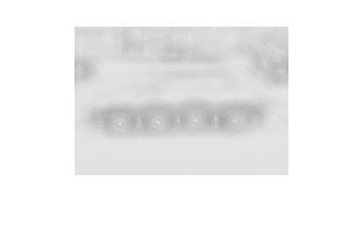

# 算法表述

### 1. 使用相关计算实现图像位置检测

> 给定图像car.png和模版图像wheel.png，利用相关检测实现对car图像中的 wheel检测，具有最大相关值的位置可以解释为所检测到的wheel位置。程序的输 入是图像和模版，要求： 
>
> （i）显示图像的相关值结果； 
>
> （ii）列出在图像中检测到的所有目标的（x，y）坐标。 

两个二维信号的相关运算，公式如下(归一化)：

在本题中，将 car.png 视作`scene`， 将 wheel.png 视作`template`。首先，读取`scene`与 `template` 并获取其大小：

```matlab
scene = imread('car.png');
[m,n] = size(scene);
template = imread('wheel.png');
[u,v] = size(template);
target = zeros(m-u+1,n-v+1); //储存相关值结果
```

**这里需要强调的是，最终储存相关值结果的矩阵的大小为 m-u+1*n-v+1**。这里的做法和课本的做法不太相同，课本的做法是通过对`scene`矩阵补零来保证最后的相关值矩阵大小与`scene`矩阵大小相同。而在本题的情景中我觉得没有必要补零，虽然补零保证了`scene`图像每个像素都被检测，但是显然这些多出来检测的图像是不可能为我们期望检测的 wheel 图像的。所以这里不检测这些像素并不影响最终结果的正确性。

```matlab
template_vec = double(template(:));
template_norm = norm(template_vec);

for i = 1:m-u+1
    for j = 1:n-v+1
        scene_sub = scene(i:i+u-1,j:j+v-1);
        scene_vec = double(scene_sub(:));
        scene_norm = norm(scene_vec);
        target(i,j) = template_vec' * scene_vec / (template_norm * scene_norm);
    end
end
```

读取到图像之后只要代入公式就可以计算出相关值矩阵。上述代码要注意的是三个计算过程中的操作：

1. `template(:)`与`scene_sub(:)`将图像矩阵张成列向量，主要是方便后续计算；
2. 使用`double()`将整数值转浮点数，主要是归一化后所有的数值都应该是落在[0,1]区间的小数，所以需要先转为浮点数处理。
3. `norm()`函数返回向量的二范数，归一化公式的分母其实就是`template_vec`与`scene_vec`两个向量二范数的乘积。

```matlab
[iMax, jMax] = find(target==max(target(:)));
disp([iMax,jMax]);

figure
imshow(target)
```

最后按照实验要求，找出最大相关值位置并输出，以及图像输出相关值结果。最终得到的最大相关值坐标为**(107,139)**(相关值为1)，相关值结果的图像如下：



### 2. 产生椒盐噪声图像，实现采用中值滤波

>（i）分别产生2个独立、在区间[ 0,255] 内均匀分布的随机矩阵。
>（ii）输入图像sport car.pgm，产生椒盐噪声图像。
>
>（iii）采用3*3 窗口实现中值滤波，注：不能使用Matlab中的‘medfilt2’。 
>
>（iv）显示原图像、椒盐噪声图像、中值滤波图像，并和采用Matlab‘medfilt2’ 的结果做比较。

读取图像获取大小后，循环判断每个像素点，根据题目提供的函数添加椒盐噪声：

```matlab
for i = 1:m
    for j = 1:n
        if car(i,j) > t1(i,j)
            noise(i,j) = 255;
            continue;
        end
        if car(i,j) < t2(i,j)
            noise(i,j) = 0;
            continue;
        end
        noise(i,j) = car(i,j);
    end
end
```

得到的椒盐噪声图像如下：


使用3*3的窗口实现滤波：

```matlab
handled = nlfilter(noise,[3 3],@matrixMedian);
```

`@matrixMedian` 指向自定义的一个函数`matrixMedian(x)`：

```matlab
function scalar = matrixMedian(x)
scalar = median(x(:));
```

这里用到的是matlab中的`nlfilter()`函数，函数原型为：

```matlab
nlfilter(A,[m n],fun)
```

该函数的作用是对矩阵A的每个像素的m*n邻域应用fun函数处理，在这里自定的`matrixMedian(x)`的功能是计算给定邻域矩阵中所有值的中位数，这样就实现了中位滤波的功能。滤波效果以及与matlab内建的`medfilt2()`对比如下：

> 该程序效果：


> medfilt2() 效果：

