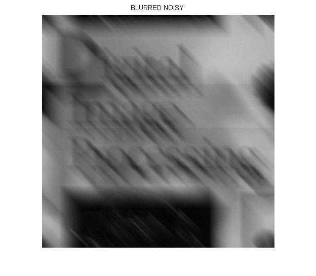
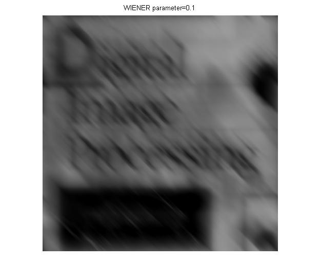
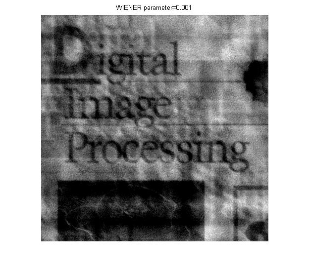

# 算法表述

### Image Restoration

#### Step 1

> The scoring method for this project is as follows: 
>
> 1. Implement a blurring filter using the equation (5.6-11，数字图像处理（第三版）) 
>   in textbook, and blur the test image ‘book_cover.jpg’ using parameters a=b=0.1 and 
>   T=1. (20%) 

主体实现代码如下

```matlab
[M,N]=size(I);
F=fftshift(fft2(I));

a=0.1;
b=0.1;
T=1;
[u,v]=meshgrid((1:M)-M/2,(1:N)-N/2);
H=T./(pi*(u*a+v*b)).*sin(pi*(u*a+v*b)).*exp(-1i*pi*(u*a+v*b));
H(isnan(H)) = 1;

R=H.*F;
blurred=real(ifft2(ifftshift(R)));
blurred=blurred(1:M,1:N);
```

算法思路分三步：1.读取图像后进行傅里叶变化并中心化，得到矩阵 F；2.根据参数计算获得退化函数 H；3.将 H 与 F 进行点乘，反傅里叶变换后获得运动模糊图像。

易错的以及需要强调的有以下几点：

1. 退化函数需要以图像中心点为原点：`[u,v]=meshgrid((1:M)-M/2,(1:N)-N/2);`
2. 根据公式，退化函数可能出现值为 NaN 的情况，需要单独处理：`H(isnan(H)) = 1;`

进行上述处理后，得到的效果图像如下:


#### Step 2

>2. Add Gaussian noise of 0 mean and variance of 500 to the blurred image. (10%) 

主体实现代码如下：

```matlab
mean=0;
var=500;
N=var/255^2*randn(M,N)+mean;
blurred_noisy=blurred+N;
```

算法思路分三步：1.设定均值与方差值；2.计算出高斯噪声信号 N；3.将 N 与原图叠加。

进行上述处理后，得到的效果图像如下:



#### Step 3

>3. Restore the blurred image and the blurred noisy image using the inverse filter. 
>   (30%) 

主体实现代码如下

```matlab
F_B=fftshift(fft2(blurred));
F_BN=fftshift(fft2(blurred_noisy));

inv=inverse(H);

F_B_inv=F_B.*inv;
F_BN_inv=F_BN.*inv;

blurred_inverse = ifft2(ifftshift(F_B_inv));
blurred_noisy_inverse = ifft2(ifftshift(F_BN_inv));
```

`inverse()`函数如下：

```matlab
function inv = inverse(H)
    H(abs(H)<0.1)=0.1;
    inv=H.^(-1);
end
```

算法思路分三步：1.读取图像后进行傅里叶变化并中心化；2.根据退化函数 H 计算获得逆滤波函数 inv；3.将 inv 与傅里叶变化后的图像进行点乘，反傅里叶变换后获得恢复图像。

易错的以及需要强调的是：当退化函数的值很小的时候，其值对恢复图像的值大小的影响很大，容易造成误差，所以将处理频率限制在一定的阈值之上。例如代码中：`H(abs(H)<0.1)=0.1;`，限制了频率绝对值一定大于等于0.1，避免较大的估计误差。

进行上述处理后，得到的效果图像如下:


#### Step 4

>4. Restore the blurred noisy image using the parametric Wiener filter with at least 3 
>   different parameters, and compare and analyse results with that of 3. (40%)

主体实现代码如下

```matlab
for i=1:3
    para=[0.1,0.01,0.001];
    wie=wiener(H,para(i));
    F_BN_wie=F_BN.*wie;
    blurred_noisy_wiener = ifft2(ifftshift(F_BN_wie));
    
    figure(5+i);
    imshow(blurred_noisy_wiener);
    title(['WIENER parameter=',num2str(para(i))]);
end
```

`wiener`函数实现如下：

```matlab
function wie = wiener(H,k)
    wie=H.^(-1).*(abs(H).^2./(abs(H).^2+k));
end
```

算法思路分三步：1.创建一个具有3个元素的参数数组，循环执行3次，每次选择一个作为参数；2.根据退化函数 H 与参数计算获得维纳滤波函数 wie；3.将 wie 与傅里叶变化后的图像进行点乘，反傅里叶变换后获得恢复图像。

进行上述处理后，得到的效果图像如下：

当参数等于0.1时：



当参数等于0.01时：


当参数等于0.001时：

